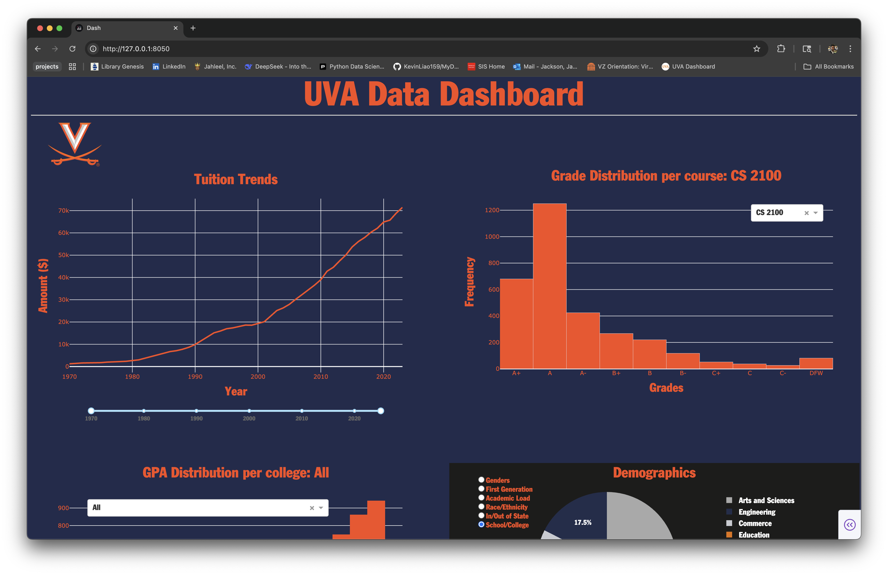

# UVA Data Dashboard



To actually interact with the dashboard, click [here](https://uva-dashboard.onrender.com).

## Description

### What does it do?

The UVA Data Dashboard allows users to explore various analytics relating to the University of Virginia. 
Users can view the following:
- Tuition trends
    - Range slider feature for zooming in/out
- Course Grade Distributions
    - View the distribution of grades from specific courses from the last 5 years 
- School GPA Distributions
    - Explore the distribution of course GPA averages within a specific school or college
- Demographic Pie Chart
    - Select demographics to view at UVA (2024-25 school year)

### Motivations

As with every project I begin, especially in the beginning of my skill development journey as a machine learning engineer and data scientist, I must learn at least one new technology in order to complete it. Building a dashboard is a staple skill needed by virtually every data scientist and I had never done anything of the like. At the time of typing this README, I have minimal experience in creating and/or designing interactive web pages for stakeholders, and I knew that a project such as this would force me to challege that component of my skillset. Lastly, I have just been accepted into UVA Engineering-- my dream school -- and wanted this project be to themed towards UVA in some way. 

### Technology Stack

Technologies used:

- Python
    - Dash for dashboard server and layout
    - Plotly for charts
    - Pandas for analysis and data manipulation

- CSS

### Challenges & Features to Implement

As with learning anything new, it was fairly challenging to get through the stage where you constantly feel dumb. I had never dealt with Dash or Plotly before this project, so I needed to build a mental model from scratch. However, my previous experience in Flask, Pandas, and HTML/CSS helped to get me going much faster. Past that, building the interactive charts was pretty straightforward. I'd say future features could be API integration with the UVA Data Analytics website to get the most current data.  

## Instructions to Run 

To run this project, follow these instructions:

1. Install the following dependencies (run below in your command line)
```bash
pip install pandas dash plotly 
```
2. Clone this repository.
3. Navigate to directory path in your CLI, ie.
```bash
jahleeljackson/Projects/dashboard_project/src
```
4. Run app with 'python3 app.py' or 'python app.py' depending on your python version.
5. Enter [http://127.0.0.1:8050/](http://127.0.0.1:8050/) in browser.
6. Explore!

## Resources

Some resources for those who'd like to learn more about the technologies used

- [Dash App Documentation](https://dash.plotly.com/)
- [Plotly Documentation](https://plotly.com/python/)
- [Pandas Documentation](https://pandas.pydata.org/docs/)
- [UVA Data Source](https://ira.virginia.edu/university-data-home)
